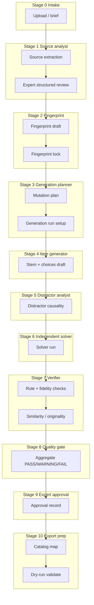

# AI Pipeline — Question Studio

## Status

**DEFINED (Gate 1 Architect)** — Staged pipeline from source brief through quality gate. Schemas in `docs/AI_SCHEMAS.md`. Pedagogy semantics authority: `docs/PEDAGOGICAL_FINGERPRINT_SPEC.md`, `docs/QUESTION_GENERATION_RULES.md`.

## Principles

1. **Stages are sequential with explicit gates** — downstream stages reject or quarantine invalid upstream output (Zod + business rules).
2. **Human lock points** — structured source acceptance, fingerprint lock, approval (UX spec); models propose, experts authorize.
3. **No self-certification** — generator never marks its own output APPROVED; verifier + expert own approval.
4. **Solver independence** — Stage 6 uses a disjoint provider profile from Stage 4–5.
5. **Audit everything** — each stage persists inputs hash, schema version, provider/model ids, duration, and output blob reference.

---

## Pipeline overview



---

## Stage 0 — Intake brief

| Item | Detail |
|------|--------|
| **Input** | Source file(s), optional subject/topic hints, mission metadata (S03). |
| **Output** | `SourceFile` + `Mission` in **Intake** phase. |
| **AI** | None required. |
| **Gate** | File validation (size, type, checksum). |

---

## Stage 1 — Source analyst (extraction)

| Item | Detail |
|------|--------|
| **Role name** | **Source analyst** — structures raw source into blocks. |
| **Provider** | `ISourceAnalystProvider` (vision/layout + OCR post-process or document parser). |
| **Input** | Source file bytes + page range + brief hints. |
| **Output** | `SourceExtractionSchema` per detected item; wrapped in `ExtractionJob` result. |
| **Validation** | Zod parse; minimum stem + choice block presence; confidence per block for UX S05. |
| **Human gate** | Expert accepts/rejects structured review (S05) → creates **SourceQuestion**. |
| **Failure** | Retry job with backoff; defect tags for inspector panel. |

**Non-goals:** Fingerprint inference, generation, or Denedio mapping at this stage.

---

## Stage 2 — Fingerprint draft & lock

| Item | Detail |
|------|--------|
| **Provider** | `IFingerprintInferenceProvider` proposes draft; expert edits in Fingerprint Studio (S07). |
| **Input** | Accepted `SourceQuestion.structured` + optional curriculum hints. |
| **Output** | `PedagogicalFingerprintSchema` (DRAFT) → **LOCKED** version with evidence bundle. |
| **Validation** | All required dimensions populated or NOT_APPLICABLE with rationale; evidence pointers for non-default claims. |
| **Human gate** | **Lock** action (S07) — blocks Stage 3 until complete. |
| **Versioning** | Invariant edits after lock → new fingerprint version (architecture doc). |

---

## Stage 3 — Generation planner (mutation plan)

| Item | Detail |
|------|--------|
| **Provider** | `IGenerationProvider` (plan-only mode) or dedicated planner prompt on same interface. |
| **Input** | Locked `PedagogicalFingerprintVersion` + run parameters (sibling count, constraints from S08). |
| **Output** | One **MutationPlanSchema** per planned candidate (required before text generation). |
| **Validation** | `fingerprint_ref` matches locked version; `surface_mutations` non-empty for batch siblings (T6); trivial-mutation pre-check warnings in UI. |
| **Human gate** | Expert confirms run setup (S08) — may edit plans before spawn. |

---

## Stage 4 — Item generator (stem + choices)

| Item | Detail |
|------|--------|
| **Provider** | `IGenerationProvider` (generate mode). |
| **Input** | MutationPlan + fingerprint version (read-only). |
| **Output** | `GeneratedQuestionSchema` draft (stem, choices, metadata fields not yet export-mapped). |
| **Validation** | Zod; exactly one correct choice; 2–5 labels A–E consecutive; no empty mechanism placeholders. |
| **Persistence** | `GeneratedQuestionCandidate` under `GenerationRun`. |
| **Forbidden shortcuts** | No generate call without persisted `MutationPlan`; no source stem in provider input (fingerprint + plan only); no bypass of fingerprint **LOCKED** gate; merging plan+generate in one call without storing plan first is invalid. |

---

## Stage 5 — Distractor analyst (causality)

| Item | Detail |
|------|--------|
| **Provider** | `IDistractorAnalysisProvider` (may be same vendor as Stage 4 with **different prompt profile** — still log separate stage). |
| **Input** | GeneratedQuestion draft + fingerprint distractor/mechanism fields. |
| **Output** | `DistractorAnalysisSchema` attached per wrong choice. |
| **Validation** | Each wrong option has error path, `mechanism_id` ⊆ fingerprint set, `produces_value` consistency. |
| **Rule** | Fail Stage 5 on T4 (decorative distractor) before solver. |

Causality is **proposed** here; Verifier spot-checks; expert resolves disputes (S11 drawer).

---

## Stage 6 — Independent solver

| Item | Detail |
|------|--------|
| **Provider** | **`ISolverProvider` only** — config MUST differ from Stage 4 model id or use `solverProfile: independent`. |
| **Input** | Question text + choices **only** (no mutation plan, no fingerprint, no source stem). |
| **Output** | `SolverResultSchema` (selected label, reasoning trace, confidence band, ambiguity flags). |
| **Validation** | Solver label must match keyed correct answer or emit ambiguity FAIL upstream of approval. |
| **Independence checks** | Architecture stores `independentOfGenerationRunId`; CI test asserts provider config hash ≠ generation config hash. |

---

## Stage 7 — Verifier (rules + fingerprint fidelity)

| Item | Detail |
|------|--------|
| **Engine** | Primary: **deterministic rule engine** (T1–T6, choice invariants, skeleton phase typing). Secondary: optional `IVerifierProvider` for narrative explanations. |
| **Input** | Candidate + fingerprint version + mutation plan + solver result + distractor analysis + optional source reference for copy checks. |
| **Output** | `VerificationResultSchema` with grouped findings. |
| **Fingerprint fidelity** | Dimension verdicts: PRESERVED / DRIFT / NOT_APPLICABLE / UNVERIFIED — **not** a single 0–100 score (pedagogy spec). |
| **Aggregate** | APPROVE / REJECT / REVISE_FINGERPRINT recommendation for expert (not auto-apply). |

### Similarity / originality substage (within Stage 7)

| Check | Intent | Typical owner |
|-------|--------|----------------|
| **Structural isomorphism (T1)** | Strip numerals → compare reasoning skeleton | Rule engine |
| **Wording overlap (T2)** | n-gram / embedding vs source stem | `IEmbeddingProvider` + thresholds |
| **Sibling distance (T6)** | Compare candidates in same run | Rule engine on mutation plan diffs |
| **Near-duplicate catalog** | Compare against approved Studio corpus | Embedding index (future) |

Similarity outputs are **findings** (PASS/WARNING/FAIL), never sole approval gate.

---

## Stage 8 — Quality gate (automated)

Aggregates Stage 5–7 into a **single automated gate** for UX S12 and blockers S01.

| Outcome | Condition |
|---------|-----------|
| **GATE_PASS** | Zero FAIL findings; all mandatory dimensions PRESERVED or NOT_APPLICABLE; solver consistent. |
| **GATE_CONDITIONAL** | Zero FAIL; one or more WARNING (expert acknowledgment required). |
| **GATE_FAIL** | Any FAIL finding or UNVERIFIED on mandatory automated path. |

Maps to export: **GATE_FAIL** blocks S13 approve and S18 export.

---

## Stage 9 — Expert approval

| Item | Detail |
|------|--------|
| **AI** | None — checklist + comment (S13). |
| **Input** | Quality gate summary + verification bundle. |
| **Output** | `ApprovalRecord` + promote candidate → **GeneratedQuestion** + `QuestionVersion` v1. |

---

## Stage 10 — Export prep (payload + dry-run)

| Item | Detail |
|------|--------|
| **AI** | None — mapping uses catalog mirror + rules. |
| **Input** | Approved `QuestionVersion` + `DenedioFieldMapping`. |
| **Output** | `QuestionImportPayloadSchema` + local dry-run result (S18). |
| **Validation** | Denedio Zod parity + choice invariants + Studio FK checks against catalog mirror + stable `externalKey`. |

---

## Provider abstraction

### Core interfaces (TypeScript-shaped; Implementer owns files)

```typescript
// shared/ai/types.ts (conceptual)

interface AIStageContext {
  missionId: string;
  schemaVersion: string;
  promptTemplateId: string;
  promptTemplateVersion: string;
}

interface AIStageResult<T> {
  output: T;
  providerId: string;
  modelId: string;
  inputTokenCount?: number;
  outputTokenCount?: number;
  latencyMs: number;
  rawRef?: string; // object storage pointer for audit
}

interface ISourceAnalystProvider {
  extract(input: { sourceFileRef: string; pageRange?: [number, number] }): Promise<AIStageResult<SourceExtractionSchema>>;
}

interface IFingerprintInferenceProvider {
  draftFingerprint(input: {
    structured: SourceExtractionSchema;
    hints?: Record<string, string>;
  }): Promise<AIStageResult<PedagogicalFingerprintSchema>>;
}

interface IGenerationProvider {
  planMutation(input: {
    fingerprint: PedagogicalFingerprintSchema;
    fingerprintVersionId: string;
    constraints: GenerationRunConstraints;
  }): Promise<AIStageResult<MutationPlanSchema>>;

  generateQuestion(input: {
    plan: MutationPlanSchema;
    fingerprint: PedagogicalFingerprintSchema;
  }): Promise<AIStageResult<GeneratedQuestionSchema>>;
}

interface IDistractorAnalysisProvider {
  analyze(input: {
    question: GeneratedQuestionSchema;
    fingerprint: PedagogicalFingerprintSchema;
  }): Promise<AIStageResult<DistractorAnalysisSchema>>;
}

interface ISolverProvider {
  solve(input: {
    questionText: string;
    choices: Array<{ label: string; text: string }>;
    profile: "independent";
  }): Promise<AIStageResult<SolverResultSchema>>;
}

interface IVerifierProvider {
  assist(input: {
    question: GeneratedQuestionSchema;
    fingerprint: PedagogicalFingerprintSchema;
    solver: SolverResultSchema;
  }): Promise<AIStageResult<Partial<VerificationResultSchema>>>;
}

interface IEmbeddingProvider {
  embed(texts: string[]): Promise<number[][]>;
  similarity(a: number[], b: number[]): number;
}
```

### Registry

- `AIProviderRegistry` resolves implementations from env (`AI_SOURCE_PROVIDER`, `AI_GENERATION_PROVIDER`, `AI_SOLVER_PROVIDER`, …).
- **Hard rule:** `AI_SOLVER_PROVIDER` / model MUST NOT equal generation default unless Orchestrator explicitly waives for dev-only with banner.

---

## Verifier finding severities (PASS / WARNING / FAIL)

Used in `VerificationResultSchema` and UX severity mapping.

| Level | Meaning | UX map | Blocks approval? | Blocks export? |
|-------|---------|--------|------------------|----------------|
| **PASS** | Check satisfied; evidence attached. | Pass / informational | No | No |
| **WARNING** | Risk or policy edge; expert may acknowledge. | P1 Major acknowledge | No (after ack) | No |
| **FAIL** | Hard rule or DRIFT/UNVERIFIED on required dimension. | P0 Blocker | Yes | Yes |

**Examples:**

- Solver mismatch → **FAIL**
- T1 structural isomorphism → **FAIL**
- High stem overlap → **WARNING** or **FAIL** per Product threshold (default WARNING if overlap moderate)
- Optional dimension NOT_APPLICABLE with rationale → **PASS**

---

## Generation run record (audit)

Each `GenerationRun` stores:

| Field | Purpose |
|-------|---------|
| `stageLog[]` | ordered stage name, status, providerId, modelId, startedAt, endedAt |
| `promptTemplateVersions` | map stage → version |
| `inputSchemaVersion` / `outputSchemaVersion` | from `docs/AI_SCHEMAS.md` header |
| `cancelledAt` | UX cancel (S09) |

Re-run policy: new run id; never overwrite prior candidate blobs (immutability).

---

## Failure & rework loops

| From | Loop back to | Trigger |
|------|--------------|---------|
| Stage 7 | Stage 4–5 | REJECT trivial/mechanism/distractor |
| Stage 7 | Stage 2 | REVISE_FINGERPRINT |
| Stage 10 | Stage 9 / mapping UI | Dry-run FK or missing mandatory field |
| Stage 1 | Stage 0 | Extraction reject |

---

## References

- `docs/AI_SCHEMAS.md`
- `docs/ARCHITECTURE.md`
- `docs/UX_SPEC.md` — S04–S12, S18
- `docs/QUESTION_GENERATION_RULES.md`
- `docs/PEDAGOGICAL_FINGERPRINT_SPEC.md`
