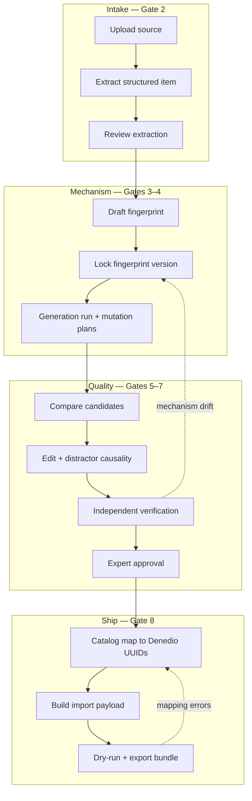

# Product Spec — Question Studio

## Status

**DEFINED (Gate 1 — Orchestrator coherence pass, 2026-09-18)** — Actionable product definition aligned with Contract Reader, Pedagogy Expert, and Designer deliverables. Application implementation **NOT STARTED**.

## One-line definition

**Question Studio** is an expert-facing studio for turning licensed or owned **source items** into **pedagogically faithful generated questions**, with auditable mechanism preservation, independent verification, and **Denedio-compatible export**—without modifying Denedio or connecting to its production database.

---

## Problem

### What is broken today

Assessment teams routinely need **more items in the same mechanism family** as high-quality sources (past papers, publisher banks, internal prototypes). Common shortcuts fail product and psychometric intent:

| Failure mode | Why it matters |
|--------------|----------------|
| **Numeric / synonym substitution** | Looks “new” but preserves no mechanism; weakens difficulty and trap structure. |
| **Ungoverned LLM paraphrase** | No invariant set, no distractor causality, no evidence trail—cannot defend in review. |
| **Copy-paste into Denedio** | Bypasses import validation; `externalKey`, curriculum UUIDs, trap metadata, and preview/persist gaps cause silent rework. |
| **Tool sprawl** | Extraction, authoring, verification, and export live in different places with no **mission thread** or provenance. |

### What we are solving

A single **studio mission** from **source intake → structured extraction → locked pedagogical fingerprint → controlled generation → expert edit → independent verification → catalog mapping → dry-run export**, where every approval step produces **artifacts a Verifier can audit**, not a single “quality score.”

---

## Users and jobs-to-be-done

### Primary persona — Assessment / item expert

Subject-matter or psychometric expert who must **sign off pedagogical fidelity** before anything ships to Denedio.

| Job | Success signal |
|-----|----------------|
| Ingest a source and trust extraction | Structured blocks match source; defects flagged, not hidden |
| Authorize what “same challenge” means | Fingerprint invariants locked with evidence |
| Generate siblings without trivial clones | Candidates differ on surface; mechanism dimensions preserved |
| Fix distractors with traceable error paths | Each wrong option linked to mechanism + misconception |
| Approve with defensible bundle | Solver + rule findings + fingerprint checklist attached |
| Export without production surprise | Dry-run matches persist constraints; `externalKey` strategy clear |

### Secondary persona — Operations / pipeline reviewer

Monitors **queues and blockers** (stuck extraction, failed dry-run, verification backlog)—**not** the homepage hero. Needs deep links into remediation screens (S04, S12, S18).

### Out of scope personas (V1)

- Student-facing delivery, live exam proctoring, or Denedio admin RBAC replication inside Question Studio.
- Casual “prompt and publish” authors without expert review on generation paths.

---

## Core product philosophies

These are **non-negotiable** product rules; Implementer and Architect must not trade them for convenience.

1. **Different question, same pedagogical challenge** — Generation is controlled mutation of an **approved fingerprint**, not paraphrase of the source stem (`docs/PEDAGOGICAL_FINGERPRINT_SPEC.md`, `docs/QUESTION_GENERATION_RULES.md`).
2. **Evidence over scores** — Fidelity is dimension-level **PRESERVED / DRIFT / NOT_APPLICABLE / UNVERIFIED** with citations; **no single 0–100 gate**.
3. **Causality for every distractor** — Wrong options require documented error paths and mechanism linkage (Gate 5 semantics).
4. **Solver independence** — The component that proposes answers must not be the same pipeline stage that self-certifies correctness (Gate 6).
5. **Provenance by default** — Missions, fingerprint versions, mutation plans, generation runs, approvals, and export attempts append to an **audit trail** visible in the studio shell (`docs/UX_SPEC.md` provenance strip).
6. **Denedio is downstream, not embedded** — Question Studio owns QB domain; Denedio receives **validated import payloads** per confirmed contract (`docs/DENEDIO_CONTRACT.md`). No production DB coupling.
7. **Studio, not dashboard** — UX optimizes reading stems, comparing mechanisms, and signing off—not KPI tiles or generic CRUD (`docs/UX_SPEC.md` anti-patterns).

---

## Differentiation

| Dimension | Typical “AI question tool” | Question Studio |
|-----------|---------------------------|-----------------|
| Unit of reuse | Prompt or template text | **Versioned pedagogical fingerprint** with invariants |
| Quality gate | Model confidence or similarity | **Verifier bundle** + trivial-mutation rejection rules |
| Distractors | “Plausible wrong answers” | **Mechanism taxonomy + error path records** |
| Export | Ad hoc JSON | **Contract-mapped payload**, dry-run, `importExternalKey` idempotency |
| UX | Admin tables | **Mission rail** S01–S18, mechanism-first comparison |

---

## End-to-end workflow (product view)

Maps to expert workflow in `docs/UX_SPEC.md` (screens S01–S18).



### Phase artifacts (exit criteria)

| Phase | Expert exit artifact | Consumed by |
|-------|---------------------|-------------|
| Intake | Accepted **StructuredSource** (or annotated defects) | Fingerprint draft |
| Mechanism | **Locked fingerprint version** + evidence bundle | Generation runs |
| Generation | Shortlisted **candidates** with linked mutation plans | Editor / verification |
| Candidates | **Approved QuestionVersion** + verification bundle | Catalog / export |
| Ship | **Dry-run pass record** + export package + proposed `externalKey` | Denedio admin import (human or future API wrapper) |

---

## Question and mission lifecycle

### Mission (studio thread)

A **mission** ties one intake path (usually a source) through phases. It carries phase state, blockers, and provenance events—this is the primary navigation object on S01, not a global “all questions” dashboard.

### Source-side vs generated-side (conceptual)

| Concept | Role |
|---------|------|
| **Source item / StructuredSource** | Evidence and provenance; **not** a paste template for generation |
| **Pedagogical fingerprint (versioned)** | Canonical mechanism record for a source (or archetype instance) |
| **Generated candidate** | Output of a mutation plan; may become edited draft |
| **Approved question record** | Expert-signed version with verification bundle |
| **Export payload** | Denedio-shaped JSON item(s) derived from approved record |

Lifecycle states (product-level; exact enums in Architect doc):

```
Source: uploaded → extracting → extracted → (defective | accepted)
Fingerprint: draft → in_review → locked → superseded
Candidate: spawned → editing → in_verification → approved | rejected
Export: mapping_draft → dry_run_failed | dry_run_passed → exported
```

Revisions to **invariants** after lock require a **new fingerprint version** and re-verification of dependent candidates (`docs/PEDAGOGICAL_FINGERPRINT_SPEC.md`).

---

## Denedio boundary

### What Question Studio owns

- All QB storage, missions, fingerprints, generation provenance, verification bundles, catalog **mirror/cache** for UUID picking, payload assembly, and dry-run simulation **against contract rules**.
- Convention for **`externalKey`** (e.g. `qs:{questionId}`) until Denedio adds first-class provenance fields (`docs/DENEDIO_CONTRACT.md` PROPOSED).

### What Denedio owns (read-only reference)

- Authoritative curriculum, trap types, archetypes, import persistence, permissions (`QUESTION_REVIEW` for bulk import), object storage for choice media.
- Confirmed import shape: `importQuestionsSchema` → preview (no DB) / persist (transactional).

### Explicit prohibitions

| Prohibition | Rationale |
|-------------|-----------|
| Modify `C:\Users\PC\Desktop\sinav` | Gate 0 / D-002 |
| Connect Question Studio to **Denedio production database** | Blast radius; contract is JSON + optional future API wrapper |
| Invent Denedio fields without **PROPOSED** marking | Contract Reader authority |
| Auto-persist to Denedio in V1 without explicit export action | Human gate on production import |

### Import / dry-run product behavior (V1 target)

- **Preview parity awareness:** Denedio preview skips some FK checks; Studio dry-run should **document** which checks run locally vs which only fail at Denedio persist—experts see this on S18 (`docs/DENEDIO_CONTRACT.md`).
- **Batch limit:** Respect Denedio max **200** items per batch when bundling exports.
- **Media:** Import JSON supports choice `assetStorageKey` only after upload; stem/solution `QuestionAsset` requires post-create media APIs—Studio must not claim full figure export until workflow defined (PROPOSED).

---

## Non-goals

### Product non-goals (V1)

- Replacing Denedio authoring UI or implementing full Denedio RBAC.
- Unsupervised high-volume generation without expert fingerprint lock and approval.
- Student practice apps, adaptive testing engines, or live exam delivery.
- Automatic production import into Denedio without expert-triggered export.
- Org-wide skill taxonomy administration (may **reference** external ids; not build full curriculum CMS).
- CSV export to Denedio until Denedio implements CSV import (contract gap noted).

### Engineering non-goals (bootstrap / Gate 1)

- Application scaffold before Gate 1 acceptance (D-003).
- Numeric “similarity threshold” as sole generation acceptance.

---

## V1 scope

### In scope

| Area | V1 commitment |
|------|----------------|
| **Screens** | Full expert path **S01–S18** per `docs/UX_SPEC.md` (implement incrementally per `docs/MASTER_BUILD_PLAN.md`) |
| **Design** | **Pedagogy Signal Lab** locked (`docs/DESIGN_SYSTEM.md`, D-004) |
| **Pedagogy** | Full fingerprint model + generation rules + trivial mutation rejection + distractor causality metadata |
| **AI pipeline** | Staged pipeline with provider abstraction (Architect spec); human review gates at fingerprint lock and approval |
| **Verification** | Independent solver stage + rule findings; Verifier PASS/WARNING/FAIL semantics |
| **Denedio** | Payload mapper, local dry-run validator against confirmed Zod shape, export bundle for admin import UI |
| **Catalog** | Read-only mirror or sync strategy for UUID selection (Architect—no production DB) |

### V1 deferrals (document, do not silently ship)

- Machine-facing authenticated Denedio import API (PROPOSED wrapper).
- Dual-control approval (second signatory)—UX optional hook only.
- Full stem/solution asset pipeline in one click export.
- High batch unattended generation without expert batch review policy (conservative default in generation rules).

---

## Success metrics (V1)

Qualitative gates dominate; metrics support **audit**, not vanity dashboards.

| Metric | Definition | Target direction |
|--------|------------|------------------|
| **Trivial mutation catch rate** | Candidates rejected by T1–T6 before expert edit | High; logged with reason codes |
| **Dry-run first-pass rate** | Approved questions passing Studio dry-run without mapping rework | Increase over time |
| **Time-to-approved** | Mission created → first approved export | Baseline then improve; not optimized by skipping verification |
| **Fingerprint reuse** | Approved fingerprints with ≥1 faithful sibling | Validates mechanism-first reuse |
| **Verifier rejection reasons** | Tagged DRIFT / distractor / mapping | Drive rule and UX fixes |
| **Provenance completeness** | % approvals with full verification bundle | 100% for production export path |

No homepage KPI tiles; metrics available to ops persona via mission/blocker views and export logs.

---

## Dependencies and source-of-truth map

| Topic | Document | Owner |
|-------|----------|-------|
| Denedio field mapping | `docs/DENEDIO_CONTRACT.md` | Contract Reader |
| Fingerprint semantics | `docs/PEDAGOGICAL_FINGERPRINT_SPEC.md` | Pedagogy Expert |
| Generation & distractors | `docs/QUESTION_GENERATION_RULES.md` | Pedagogy Expert |
| UX & screens | `docs/UX_SPEC.md` | Designer |
| Visual system | `docs/DESIGN_SYSTEM.md` | Designer |
| System shape & schemas | `docs/ARCHITECTURE.md`, `docs/AI_PIPELINE.md`, `docs/AI_SCHEMAS.md` | Architect |
| Build sequencing | `docs/MASTER_BUILD_PLAN.md` | Orchestrator |
| Decisions | `docs/DECISIONS.md` | Orchestrator + specialists |

---

## Gate 1 alignment checklist

| Criterion | Status |
|-----------|--------|
| Product spec actionable | **This document** |
| Denedio contract analyzed | **Complete** (Wave A) |
| Fingerprint + generation rules | **Complete** (Wave B) |
| UX 18 screens + design lock | **Complete** (Wave C; Orchestrator accepts D-004) |
| Architecture + AI schemas | **Complete** (Architect; cross-reviews logged) |

---

## Open questions

| ID | Question | Owner | Blocks |
|----|----------|-------|--------|
| OQ-1 | Catalog mirror: periodic JSON snapshot vs authenticated read API vs manual UUID paste for V1 | Architect + Product | S16 |
| OQ-2 | Trap type / archetype UUID sourcing for Studio experts | Product + ops | S17 distractor mapping |
| OQ-3 | Max auto-generated siblings per fingerprint before mandatory human compare | Product | S08 policy |
| OQ-4 | Wording overlap threshold for T2 rejection | Verifier | Gate 4+ |
| OQ-5 | Single-tenant vs multi-tenant auth for V1 | Architect | Scaffold phase |

---

## References

- `docs/UX_SPEC.md` — normative workflow and S01–S18
- `docs/DENEDIO_CONTRACT.md` — export contract
- `docs/PEDAGOGICAL_FINGERPRINT_SPEC.md` — mechanism model
- `docs/QUESTION_GENERATION_RULES.md` — mutation and rejection rules
- `docs/DESIGN_SYSTEM.md` — locked visual direction
