# UX Spec — Question Studio

## Status

**GATE 1 COMPLETE (Designer)** — Expert workflow, 18-screen inventory, and panel layouts specified. Visual system locked in `docs/DESIGN_SYSTEM.md` (**Direction B: Pedagogy Signal Lab**).

## Design authority

**DESIGN AUTHORITY: LOCKED** — 2026-09-18 — **Pedagogy Signal Lab** (see `docs/DESIGN_SYSTEM.md`, decision D-004 in `docs/DECISIONS.md`).

Implementer and Gate 9 QA must match this spec and locked tokens/components. Casual redesign requires Orchestrator + Designer approval.

---

## Product posture (anti-patterns)

Question Studio is **not** a generic admin dashboard. Avoid:

- KPI tiles, donut charts, and “total users” widgets on the landing view
- Left sidebar with 15 equal-weight links and a collapsed hamburger as the primary mental model
- Table-only CRUD for questions without pedagogical context
- Treating AI output as final without an evidence trail

Instead, the shell is a **studio rail**: one active **mission** (a source → fingerprint → generation → review → export thread) with phase-colored wayfinding, persistent **provenance strip**, and surfaces optimized for reading stems, comparing mechanisms, and signing off with auditability.

**Primary persona:** Assessment / item **expert** (psychometric or subject-matter) who must prove pedagogical fidelity before Denedio export.

**Secondary persona:** Operations reviewer who monitors queues and dry-run failures (narrow scope, not homepage hero).

---

## Expert workflow (end-to-end)

Linear **happy path** with explicit branch-back loops. Each phase has entry criteria, expert actions, and exit artifacts.

```mermaid
flowchart LR
  subgraph intake [Intake]
    H[Home Mission Board]
    SL[Sources Library]
    SU[Source Upload]
    EQ[Extraction Queue]
    SR[Structured Source Review]
  end
  subgraph mechanism [Mechanism]
    FD[Fingerprint Draft]
    FS[Fingerprint Studio]
    GR[Generation Run Setup]
    GM[Generation Monitor]
  end
  subgraph candidates [Candidates]
    CC[Candidate Comparison]
    CE[Candidate Editor]
    VF[Verification Findings]
    AP[Approval Gate]
  end
  subgraph ship [Ship]
    QR[Question Record]
    VH[Version History]
    CB[Catalog Browser]
    PM[Payload Mapper]
    DR[Dry Run Export]
  end
  H --> SL --> SU --> EQ --> SR
  SR --> FD --> FS --> GR --> GM --> CC
  CC --> CE --> VF --> AP --> QR
  QR --> VH
  QR --> CB --> PM --> DR
  VF -.->|fix mechanism| FS
  CE -.->|reject sibling| CC
  AP -.->|send back| CE
  DR -.->|mapping fix| PM
```



### Phase 0 — Orient (Home)

| Step | Expert goal | System responsibility |
|------|-------------|------------------------|
| Resume work | Pick up in-flight missions | Show missions by **phase**, blockers, and last expert action |
| Start intake | Begin new source | Deep-link to Upload with mission shell pre-created |
| Triage failures | Fix dry-run / verification blockers | Surface **blocking findings** first, not global metrics |

### Phase 1 — Source upload & extraction

| Step | Expert goal | System responsibility |
|------|-------------|------------------------|
| Upload | Attach PDF/DOCX/image/HTML with metadata | Virus/size validation; topic hints optional |
| Queue | Trust extraction progress | Job states, retry, partial preview |
| Structured review | Confirm extracted stem, assets, layout | Side-by-side source vs structured blocks; flag OCR/extraction issues |

**Exit artifact:** `StructuredSource` accepted or annotated with extraction defects.

### Phase 2 — Fingerprint review

| Step | Expert goal | System responsibility |
|------|-------------|------------------------|
| Draft review | Validate auto-inferred mechanism | Show evidence spans linked to fingerprint dimensions |
| Studio edit | Lock **invariants** vs **mutable surface** | Diff-aware editor; pedagogy spec dimensions (`docs/PEDAGOGICAL_FINGERPRINT_SPEC.md`) |
| Sign fingerprint | Authorize generation | Explicit “fingerprint locked” with version stamp |

**Exit artifact:** Locked fingerprint version referenced by all generation runs.

### Phase 3 — Generation

| Step | Expert goal | System responsibility |
|------|-------------|------------------------|
| Run setup | Choose mutation plan, sibling count, constraints | Show forbidden trivial mutations preview |
| Monitor | Observe run health | Token/step timeline; cancel; per-candidate status |
| Compare | Select siblings worth editing | Mechanism-first comparison, not stem diff only |

**Exit artifact:** Shortlisted candidate set (1..n) entering editorial pipeline.

### Phase 4 — Candidate editor & verification

| Step | Expert goal | System responsibility |
|------|-------------|------------------------|
| Edit | Refine stem, choices, media, metadata | Inline distractor **causality** panel per choice |
| Verification | Read independent solver + rule findings | Grouped severities; link to fingerprint claims |
| Approval | Sign off or send back | Dual control optional (future); immutable approval record |

**Exit artifact:** Approved `QuestionVersion` with verification bundle attached.

### Phase 5 — Catalog & Denedio payload / dry-run

| Step | Expert goal | System responsibility |
|------|-------------|------------------------|
| Catalog | Map to Denedio taxonomy | Browse read-only catalog mirror; pick topic/difficulty targets |
| Payload | Inspect mapped JSON/DTO | Field-level confirmed vs proposed (`docs/DENEDIO_CONTRACT.md`) |
| Dry run | Validate without production write | Simulate import; show Zod/API errors with fix links back to editor |

**Exit artifact:** Export package + dry-run pass record + `importExternalKey` proposal.

---

## Navigation & shell

### Studio rail (persistent)

- **Top:** Mission title, phase pill (color from design system), breadcrumb within phase only (max 3 levels).
- **Left rail (240px):** Phase groups — **Intake · Mechanism · Candidates · Ship** — not a flat app map. Disabled phases show **why** (missing artifact).
- **Bottom of rail:** Provenance mini-log (last 5 events) with “full trail” → Version History when a question exists.
- **Right (collapsible 320px):** Context drawer — fingerprint summary, open findings count, Denedio mapping warnings for current entity.

### Global affordances

- **Command palette** (`Ctrl/Cmd+K`): jump to screen by ID (S01–S18), mission, or “blocking findings”.
- **No** universal “Analytics” tab on v1.

---

## Screen inventory (18) — Gate 1 brief

Screens **S01–S18** span **Home** through **Dry Run**. Route slugs are implementer suggestions; layout and behavior are normative.

| ID | Name | Route (suggested) | Workflow phase | Purpose |
|----|------|-------------------|----------------|---------|
| **S01** | Home — Mission Board | `/` | Orient | Resume missions; blocking work queue; start intake — **not** a metrics dashboard |
| **S02** | Sources Library | `/sources` | Intake | Corpus of uploaded sources with extraction/fingerprint status |
| **S03** | Source Upload | `/sources/new` | Intake | Upload wizard + metadata; creates mission thread |
| **S04** | Extraction Queue & Job | `/sources/:id/extraction` | Intake | Job timeline, retries, worker logs (expert-readable) |
| **S05** | Structured Source Review | `/sources/:id/structured` | Intake | Source viewer ↔ structured blocks; accept/reject extraction |
| **S06** | Fingerprint Draft | `/sources/:id/fingerprint/draft` | Mechanism | AI draft with evidence spans; gap warnings |
| **S07** | Fingerprint Studio | `/fingerprint/:versionId` | Mechanism | Authoritative invariant/mutable editing + lock |
| **S08** | Generation Run Setup | `/missions/:id/generate/setup` | Mechanism | Mutation plan, counts, constraints, trivial-mutation guards |
| **S09** | Generation Monitor | `/missions/:id/generate/runs/:runId` | Mechanism | Live run steps, candidate spawn list, cancel |
| **S10** | Candidate Comparison | `/missions/:id/candidates/compare` | Candidates | Mechanism matrix across siblings |
| **S11** | Candidate Editor | `/candidates/:id/edit` | Candidates | Full item editor + distractor causality |
| **S12** | Verification Findings | `/candidates/:id/verification` | Candidates | Solver trace, rule hits, fingerprint fidelity checks |
| **S13** | Approval Gate | `/candidates/:id/approval` | Candidates | Sign-off checklist; send-back reasons |
| **S14** | Question Record | `/questions/:id` | Ship | Canonical approved view; metadata; export readiness |
| **S15** | Version History & Diff | `/questions/:id/versions` | Ship | Timeline; diff stem/choices/fingerprint/payload |
| **S16** | Catalog Browser | `/catalog` | Ship | Denedio taxonomy mirror for mapping targets |
| **S17** | Denedio Payload Mapper | `/questions/:id/denedio/map` | Ship | Field mapping UI; confirmed vs proposed badges |
| **S18** | Dry Run & Export Gate | `/questions/:id/denedio/dry-run` | Ship | Simulate import; error remediation; export bundle |

---

## Screen specifications

### S01 — Home — Mission Board

**Layout:** Single column **mission stream** (70%) + **blockers panel** (30%). No chart row.

- **Mission cards:** Title (source filename or question working title), **phase pill**, owner, “last touched”, open finding count.
- **Blockers panel:** Sorted by severity — failed dry-run, verification fail, extraction stuck, fingerprint not locked.
- **Primary actions:** “New source intake” (→ S03), “Continue last mission” (deep link to last phase screen).

**Empty state:** Illustration-free; copy explains first intake path; CTA to S03.

### S02 — Sources Library

**Layout:** Filter bar + **dense list** (not card grid). Columns: name, subject/topic hint, extraction state, fingerprint state, linked missions.

Row click → S04 if extracting, S05 if extracted, S06 if fingerprint pending.

### S03 — Source Upload

**Layout:** Two-step wizard in content well (max 720px): (1) files + drag-drop, (2) metadata (subject, language, notes).

**Right drawer:** Upload requirements, max size, supported types.

On submit → create mission → route S04.

### S04 — Extraction Queue & Job

**Layout:** **Three-panel** (see complex layouts).

### S05 — Structured Source Review

**Layout:** **Three-panel** — source fidelity focus.

- Accept extraction → enables S06.
- Reject → back to S04 with defect tags.

### S06 — Fingerprint Draft

**Layout:** **Split:** left = dimension list with confidence; right = evidence span viewer on structured source.

CTA “Open in Fingerprint Studio” → S07.

### S07 — Fingerprint Studio

**Layout:** **Three-panel** — primary expert surface for Gate 3+ fidelity.

- Lock action requires all **required dimensions** filled (per pedagogy spec).
- Shows invariant chips (locked styling) vs mutable fields (editable styling).

### S08 — Generation Run Setup

**Layout:** Form column + **preview column** showing mutation plan summary and “trivial swap” warnings.

Requires locked fingerprint version.

### S09 — Generation Monitor

**Layout:** Timeline header + candidate table filling in live. Row → S10 when run completes.

### S10 — Candidate Comparison

**Layout:** **Comparison matrix** (see complex layouts). Select 1..n for editorial track.

### S11 — Candidate Editor

**Layout:** **Editor canvas** + bottom **choice rail**; right drawer = distractor causality per selected choice.

Autosave drafts; link to S12.

### S12 — Verification Findings

**Layout:** Findings grouped: **Solver · Fingerprint · Distractor · Similarity · Schema**. Each finding expandable with evidence.

Actions: “Fix in editor” (S11), “Revise fingerprint” (S07) when mechanism mismatch.

### S13 — Approval Gate

**Layout:** Checklist (verification pass, fingerprint ref, catalog mapping present) + approval comment + **Approve / Send back**.

Send back requires reason enum + note.

### S14 — Question Record

**Layout:** Read-only stem preview (student-safe styling), metadata chips, links to S15, S17, S18.

### S15 — Version History & Diff

**Layout:** Timeline left; diff viewer right with toggles: stem / choices / fingerprint / payload.

### S16 — Catalog Browser

**Layout:** Tree + detail pane (topic metadata from contract). Selection feeds S17 defaults.

Read-only mirror; no pretend edit of Denedio production.

### S17 — Denedio Payload Mapper

**Layout:** **Field mapper** two-column: Question Studio field ↔ Denedio field; badges **CONFIRMED** vs **PROPOSED**.

Highlight missing mandatory import fields from contract.

### S18 — Dry Run & Export Gate

**Layout:** **Dry-run console** top (pass/fail, API/Zod messages); bottom = remediation links.

Export bundle download only after pass (or explicit override with audit — future policy).

---

## Complex page panel layouts

Normative grid: 12-column content area inside shell (rail excluded). Gutters 24px.

### Three-panel — Extraction & structured review (S04, S05)

```
┌──────────────────────────────────────────────────────────────┐
│ Mission header · phase · actions                             │
├──────────────┬─────────────────────────────┬─────────────────┤
│ Source       │ Structured / job main       │ Inspector       │
│ navigator    │ (PDF page, blocks, or log)  │ (metadata,      │
│ 20%          │ 50%                         │  defects, tags) │
│              │                             │ 30%             │
└──────────────┴─────────────────────────────┴─────────────────┘
```

- **S04 main:** step timeline + log lines; inspector = retry, priority.
- **S05 main:** block list with focus sync to source page; inspector = extraction confidence per block.

### Three-panel — Fingerprint Studio (S07)

```
┌──────────────────────────────────────────────────────────────┐
│ Fingerprint v3 · LOCKED/DRAFT · link to source               │
├──────────────┬─────────────────────────────┬─────────────────┤
│ Dimensions   │ Active dimension editor     │ Evidence        │
│ (grouped:    │ (invariant vs mutable       │ (source spans,  │
│  mechanism,  │  tabs, validation)          │  solver hooks)  │
│  distractors)│ 45%                         │ 30%             │
│ 25%          │                             │                 │
└──────────────┴─────────────────────────────┴─────────────────┘
```

Invariant fields use non-editable surface until explicit “unlock” with reason (audited).

### Comparison matrix — Candidate Comparison (S10)

```
┌──────────────────────────────────────────────────────────────┐
│ Run #12 · fingerprint v3 · filter: show mechanism deltas only│
├──────────────────────────────────────────────────────────────┤
│           │ Cand A │ Cand B │ Cand C │ Cand D │              │
│ Mechanism │   ✓    │   ⚠    │   ✓    │   ✗    │  ← row set │
│ Stem sim  │  low   │  med   │  low   │  high  │    from     │
│ Distractor│  ok    │  weak  │  ok    │  n/a   │    pedagogy │
│ Fingerprint│ pass  │ pass   │ fail   │ pass   │    rules    │
├──────────────────────────────────────────────────────────────┤
│ Preview drawer (expand row): side-by-side stem excerpt        │
└──────────────────────────────────────────────────────────────┘
```

Row click opens preview drawer; checkbox selects candidates for S11 batch open.

### Editor — Candidate Editor (S11)

```
┌──────────────────────────────────────────────────────────────┐
│ Stem editor (rich text + math) · media strip                 │
├──────────────────────────────────────────────────────────────┤
│ A │ B │ C │ D │ E │  choice rail — select to edit distractor │
├───────────────────────────────┬──────────────────────────────┤
│ Choice detail                 │ Causality drawer (right)     │
│ (text, misconception tag)     │ mechanism → error path       │
└───────────────────────────────┴──────────────────────────────┘
```

### Dry-run console — S18

```
┌──────────────────────────────────────────────────────────────┐
│ PASS / FAIL banner · importExternalKey preview               │
├───────────────────────────────┬──────────────────────────────┤
│ Request/response trace        │ Remediation checklist        │
│ (collapsible JSON)            │ links → S17, S11, S16        │
├───────────────────────────────┴──────────────────────────────┤
│ Export actions (disabled until pass)                         │
└──────────────────────────────────────────────────────────────┘
```

---

## Cross-cutting UX rules

### States

Every async surface exposes: **idle · loading · partial · error · stale**. Errors name the **artifact** (extraction job, generation run, dry-run) and suggest the screen to fix.

### Findings & severity

Shared scale across S12, S18, S01 blockers:

| Level | Label | Use |
|-------|-------|-----|
| P0 | Blocker | Cannot approve or export |
| P1 | Major | Expert must acknowledge |
| P2 | Minor | Informational |

Color tokens from locked design system — never rely on color alone (icon + label).

### Accessibility (Gate 9 baseline)

- Focus order: rail → main → drawer.
- Comparison matrix: keyboard navigable grid with aria labels for mechanism rows.
- Minimum touch target 44px on primary actions.

### Content design

- Prefer **mechanism** vocabulary over “AI confidence”.
- Empty states explain **what artifact unlocks the next screen**.

---

## References

- `docs/PEDAGOGICAL_FINGERPRINT_SPEC.md` — fingerprint dimensions on S06–S07, S12
- `docs/QUESTION_GENERATION_RULES.md` — S08 guards, S10 rows, S11 causality
- `docs/DENEDIO_CONTRACT.md` — S16–S18 field badges and dry-run behavior
- `docs/DESIGN_SYSTEM.md` — locked visual direction, tokens, components

## Locked-design compliance

Gate 9 compares implemented UI to this document and `docs/DESIGN_SYSTEM.md`. Material deviation is a Verifier rejection criterion per office policy.
